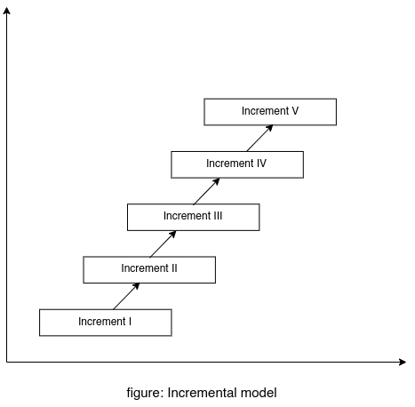

## Methodology

Software Development Life Cycle(SDLC) provides a method for building and delivering software projects. There are various stages of SDLC such as communication, planning, design, implementation, and deployment. There are various software development models like waterfall, incremental, spiral, and prototyping, which are based on the framework provided by SDLC. Each model has their usage and criteria. We found Incremental model also known as Rapid Application Development(RAD) is best suited for our project. This model combines elements of the waterfall model applied in an iterative fashion [1]. 

In our project there will be five increments, each increment will traverse through the stages of SDLC. Our end product is somehow clear but there are many requirements/features that we have to add or modify over time. In each increment, we will develop a working product and add new features to it. The incremental model provides such flexibility for software development, and the functionality in increments of our product will be something like

### 1. Increment I
- Create an environment for writing source code as a solution to a question
- Create API for compiling and running that solution
- Display the output and error of that code to the user
- Appropriate UI for that functionality

### 2. Increment II
- Develop database integration for the course
- Add a course eg C++, and contents for that course
- A way for adding questions to the database thru the web
- Appropriate UI

### 3. Increment III
- Student authentication
- Admin authentication
- Frontend for login and registration

### 4. Increment IV
- Integration of auto-grading
- Tracking the progress of the student
- Authentication of Teacher
- Review the submitted solution by the teacher

### 5. Increment V
- Extend for more courses
- Implement containerization
- Self enrollment
- Improving the product by adding more increments, if needed

[1] Salve SM, Samreen SN, Khatri-Valmik N. A Comparative Study on Software Development Life Cycle Models. International Research Journal of Engineering and Technology (IRJET). 2018 Feb;5(2):696-700.